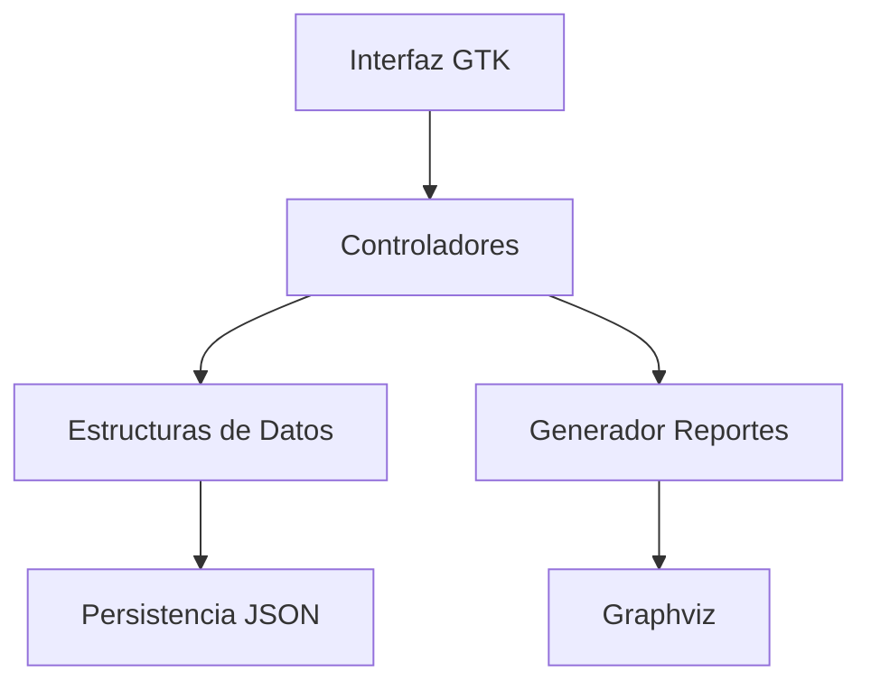
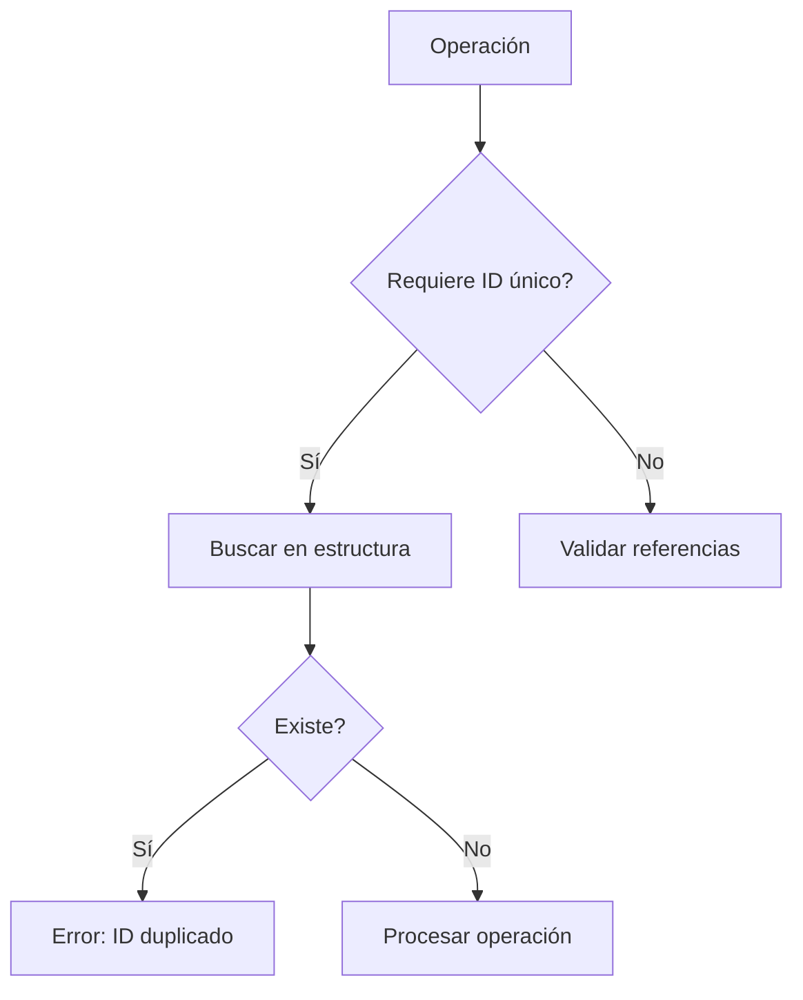

# **Manual Técnico - AutoGest Pro**  
**Sistema de Gestión para Talleres Mecánicos**  

---

## **1. Introducción**  
Este manual técnico documenta la arquitectura, diseño e implementación del sistema **AutoGest Pro**, desarrollado para la Fase 2 del curso de Estructuras de Datos. El sistema utiliza estructuras de datos avanzadas para gestionar talleres de reparación vehicular, implementado en **C#** con interfaz gráfica GTK en entorno Linux.

---

## **2. Objetivos**  

### **2.1 Objetivo General**  
Documentar los aspectos técnicos del sistema para facilitar su mantenimiento, escalabilidad y comprensión por parte del equipo de desarrollo.  

### **2.2 Objetivos Específicos**  
- Describir las estructuras de datos implementadas y su justificación  
- Explicar el flujo de datos y validaciones del sistema  
- Documentar el proceso de generación de reportes gráficos  
- Detallar el sistema de persistencia de datos  

---

## **3. Especificaciones Técnicas**  

### **3.1 Requisitos del Sistema**  
| **Componente**       | **Requisito**                          |
|----------------------|----------------------------------------|
| Sistema Operativo    | Linux (Ubuntu 22.04 recomendado)       |
| Entorno de Ejecución | .NET 6.0+                             |
| Interfaz Gráfica     | GTK# 3.0                              |
| Generación Reportes  | Graphviz 2.50                         |
| Manejo de Datos      | Newtonsoft.Json 13.0+                 |

### **3.2 Arquitectura**  


---

## **4. Estructuras de Datos**  

### **4.1 Implementación**  
| **Entidad**   | **Estructura**           | **Complejidad**       | **Justificación**                     |
|---------------|--------------------------|-----------------------|---------------------------------------|
| Usuarios      | Lista Simplemente Enlazada | Inserción: O(1)      | Operaciones dinámicas frecuentes      |
| Vehículos     | Lista Doblemente Enlazada | Búsqueda: O(n)       | Navegación bidireccional requerida    |
| Repuestos     | Árbol AVL                | Búsqueda: O(log n)   | Búsquedas rápidas por ID              |
| Servicios     | Árbol Binario            | Recorrido: O(n)      | Flexibilidad en tipos de recorrido    |
| Facturas      | Árbol B (Orden 5)        | Búsqueda: O(log n)   | Manejo eficiente de grandes volúmenes |

### **4.2 Ejemplo de Implementación (Árbol AVL)**  
```csharp
public class AVLTree {
    private AVLNode root;
    
    private class AVLNode {
        public int Id { get; set; }
        public Repuesto Data { get; set; }
        public int Height { get; set; }
        public AVLNode Left, Right;
    }

    public void Insert(Repuesto repuesto) {
        root = Insert(root, repuesto);
    }
    
    private AVLNode Insert(AVLNode node, Repuesto repuesto) {
        // Lógica de inserción con balanceo automático
    }
}
```

---

## **5. Flujo de Datos**  

### **5.1 Diagrama de Validaciones**  


### **5.2 Validaciones Clave**  
1. **Unicidad de IDs**:  
   - Verificación en estructuras antes de inserción  
   - Implementada en métodos `Insertar` de cada estructura  

2. **Integridad Referencial**:  
   - Validar existencia de `ID_Usuario` al registrar vehículos  
   - Verificar `ID_Repuesto` y `ID_Vehículo` al crear servicios  

3. **Formato de Datos**:  
   - Validación de formato JSON en carga masiva  
   - Verificación de tipos de datos (ej. costo numérico)  

---

## **6. Persistencia de Datos**  

### **6.1 Esquema JSON**  
**Ejemplo Usuarios.json**:  
```json
{
  "Usuarios": [
    {
      "ID": 1,
      "Nombres": "Juan Pérez",
      "Correo": "juan@usac.com",
      "Contrasenia": "a665a459...", // SHA-256
      "Edad": 25
    }
  ]
}
```

### **6.2 Métodos de Acceso**  
```csharp
public class DataAccess {
    public static List<Usuario> CargarUsuarios(string path) {
        string json = File.ReadAllText(path);
        return JsonConvert.DeserializeObject<List<Usuario>>(json);
    }
    
    public static void GuardarLog(string mensaje) {
        File.AppendAllText("logs.txt", $"[{DateTime.Now}] {mensaje}\n");
    }
}
```

---

## **7. Generación de Reportes**  

### **7.1 Proceso con Graphviz**  
1. Recorrer estructura de datos  
2. Generar archivo DOT:  
   ```dot
   digraph AVL {
       node [shape=record];
       "50" [label="<f0> |<f1> 50|<f2> "];
       "30" [label="<f0> |<f1> 30|<f2> "];
       "50":f0 -> "30":f1;
   }
   ```
3. Ejecutar:  
   ```bash
   dot -Tpng arbol.dot -o Reportes/avl.png
   ```

### **7.2 Directorio de Reportes**  
```
/Reportes/
├── usuarios.png
├── vehiculos.png
├── repuestos_avl.png
└── servicios_arbol.png
```

---

## **8. Control de Acceso**  

### **8.1 Autenticación**  
```csharp
public class AuthService {
    private const string ADMIN_EMAIL = "admin@usac.com";
    private const string ADMIN_PASS = "admin123";
    
    public bool Login(string email, string password) {
        if(email == ADMIN_EMAIL && password == ADMIN_PASS)
            return true;
            
        Usuario user = listaUsuarios.BuscarPorEmail(email);
        return user?.Contrasenia == HashSHA256(password);
    }
}
```

---

## **9. Pruebas Unitarias**  

### **9.1 Casos de Prueba**  
| **Módulo**         | **Prueba**                      | **Resultado Esperado**       |
|--------------------|---------------------------------|------------------------------|
| Árbol AVL          | Insertar 100 repuestos          | Altura máxima ≤ 1.44*log2(n) |
| Lista Enlazada     | Eliminar usuario intermedio     | Punteros actualizados        |
| Validación JSON    | Archivo con formato incorrecto  | Error controlado             |

---

## **10. Consideraciones de Rendimiento**  

| **Operación**          | **Complejidad** | **Notas**                     |
|------------------------|-----------------|-------------------------------|
| Búsqueda de repuesto   | O(log n)        | Gracias a AVL                 |
| Carga masiva usuarios  | O(n)            | n = registros en JSON         |
| Generación de factura  | O(log n)        | Árbol B de orden 5            |

---

