# Manual de Usuario  
**AutoGest Pro - Sistema de Gestión para Talleres de Reparación de Vehículos**  
---

## **OBJETIVOS DEL SISTEMA**  
### **General**  
AutoGest Pro es un sistema diseñado para optimizar la gestión de talleres de reparación de vehículos, permitiendo administrar usuarios, vehículos, repuestos, servicios y facturas de manera eficiente mediante estructuras de datos avanzadas.  

### **Específicos**  
- Facilitar el registro y gestión dinámica de usuarios y vehículos mediante listas enlazadas.  
- Optimizar la búsqueda y actualización de repuestos utilizando árboles AVL.  
- Organizar servicios de reparación mediante árboles binarios.  
- Gestionar facturas eficientemente con árboles B.  
- Generar reportes gráficos de las estructuras de datos implementadas.  

---

## **INTRODUCCIÓN**  
AutoGest Pro es una herramienta integral que simplifica las operaciones diarias de talleres de reparación de vehículos. Este manual proporciona una guía detallada para utilizar todas las funcionalidades del sistema, desde el inicio de sesión hasta la generación de reportes.  

---

## **INFORMACIÓN DEL SISTEMA**  
### **Roles**  
1. **Administrador**:  
   - Realiza carga masiva de datos (usuarios, vehículos, repuestos).  
   - Gestiona entidades (visualizar, eliminar, actualizar).  
   - Genera servicios y facturas.  
   - Exporta logs de acceso en formato JSON.  
   - Genera reportes gráficos con Graphviz.  

2. **Usuario**:  
   - Registra sus vehículos.  
   - Visualiza servicios y facturas.  
   - Cancela facturas pendientes.  

### **Estructuras de Datos Utilizadas**  
- **Lista simplemente enlazada**: Usuarios.  
- **Lista doblemente enlazada**: Vehículos.  
- **Árbol AVL**: Repuestos.  
- **Árbol binario**: Servicios.  
- **Árbol B**: Facturas.  

---

## **REQUISITOS DEL SISTEMA**  
- **Sistema Operativo**: Linux (distribución libre).  
- **Librería Gráfica**: GTK.  
- **Herramienta para Reportes**: Graphviz.  
- **Lenguaje de Programación**: C#.  

---

## **FLUJO DE FUNCIONALIDADES**  

### **1. Inicio de Sesión**  
- **Administrador**:  
  - Usuario: `admin@usac.com`  
  - Contraseña: `admin123`  
- **Usuarios Registrados**:  
  - Credenciales proporcionadas durante el registro.  

### **2. Rol Administrador**  
#### **Carga Masiva**  
- Permite cargar datos desde archivos JSON para las entidades:  
  - Usuarios.  
  - Vehículos.  
  - Repuestos.  

#### **Gestión de Entidades**  
- **Visualizar**: Muestra listados de usuarios, vehículos o repuestos.  
- **Eliminar**: Elimina registros seleccionados.  
- **Actualizar Repuestos**: Modifica detalles o costos de repuestos.  

#### **Generación de Servicios y Facturas**  
- Crea servicios vinculando repuestos y vehículos existentes.  
- Genera facturas automáticamente al crear un servicio.  

#### **Reportes**  
- Genera imágenes de estructuras de datos (árboles, listas) en la carpeta `/Reportes`.  

### **3. Rol Usuario**  
#### **Registro de Vehículos**  
- Permite agregar nuevos vehículos asociados al usuario.  

#### **Visualización de Servicios**  
- Muestra servicios realizados con filtros: PRE-ORDEN, IN-ORDEN, POST-ORDEN.  

#### **Gestión de Facturas**  
- Visualiza facturas pendientes.  
- Cancela facturas mediante su ID.  

---

## **INTERFACES SUGERIDAS**  

### **Administrador**  
```plaintext
1. Carga Masiva  
2. Gestión de Usuarios  
3. Gestión de Vehículos  
4. Gestión de Repuestos  
5. Generar Servicio  
6. Generar Factura  
7. Reportes  
8. Exportar Logs  
9. Salir  
```

### **Usuario**  
```plaintext
1. Insertar Vehículo  
2. Visualizar Servicios  
3. Visualizar Facturas  
4. Cancelar Facturas  
5. Salir  
```

---

## **EJEMPLOS DE USO**  

### **Carga Masiva (JSON)**  
```json
// Usuarios.json  
{  
    "ID": 1,  
    "Nombres": "Carlos Alberto",  
    "Apellidos": "Gomez Martínez",  
    "Correo": "carlos.alberto@usac.com",  
    "Edad": 20,  
    "Contrasenia": "CarlosMartinez"  
}  
```

### **Generación de Reportes**  
- Los reportes se guardan en `/Reportes` como imágenes generadas con Graphviz.  

---

## **OBSERVACIONES**  
- El usuario administrador no puede ser modificado o eliminado.  
- Las validaciones evitan duplicados en IDs y correos.  
- Para facturas, se verifica la existencia previa de servicios y vehículos.  

---

## **FLUJO DE LAS FUNCIONALIDADES DEL SISTEMA FORMA VISUAL**  

1. Iniciar aplicacion

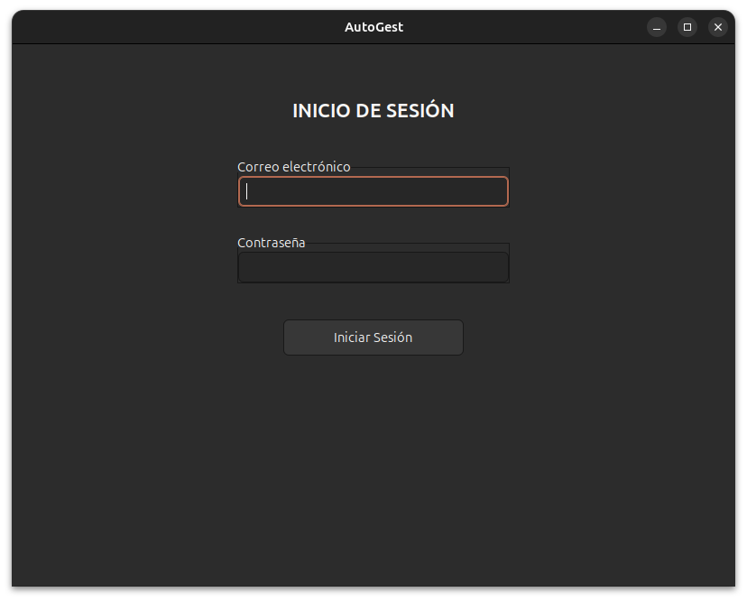

2. Ingresar con Administrador

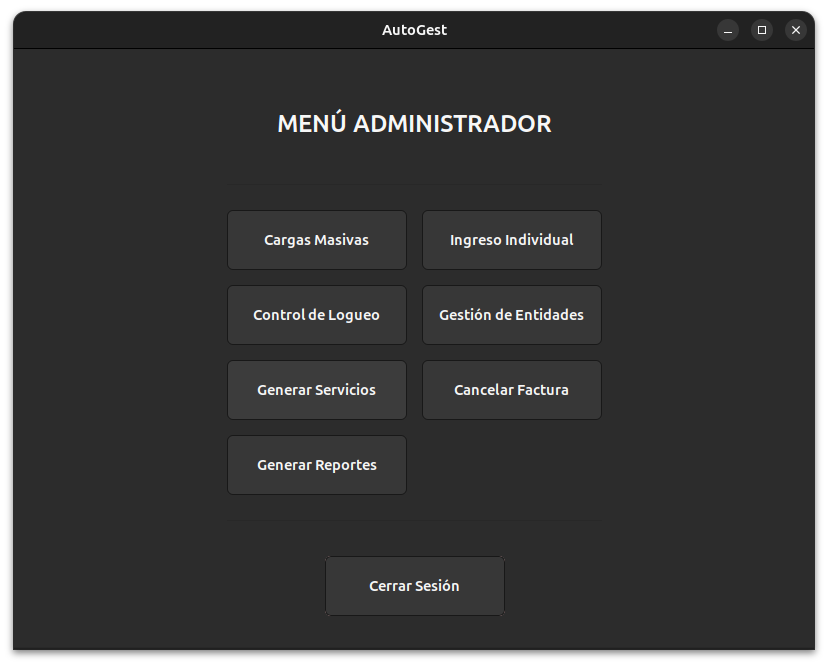

3. Carga Masiva

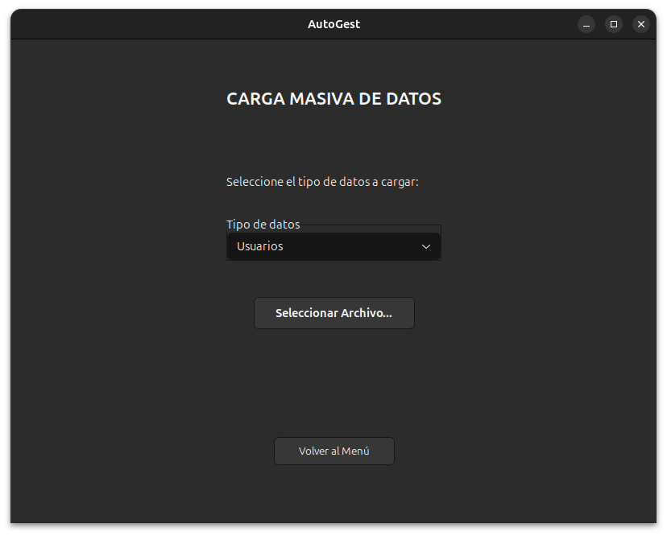

4. Ingreso Individual

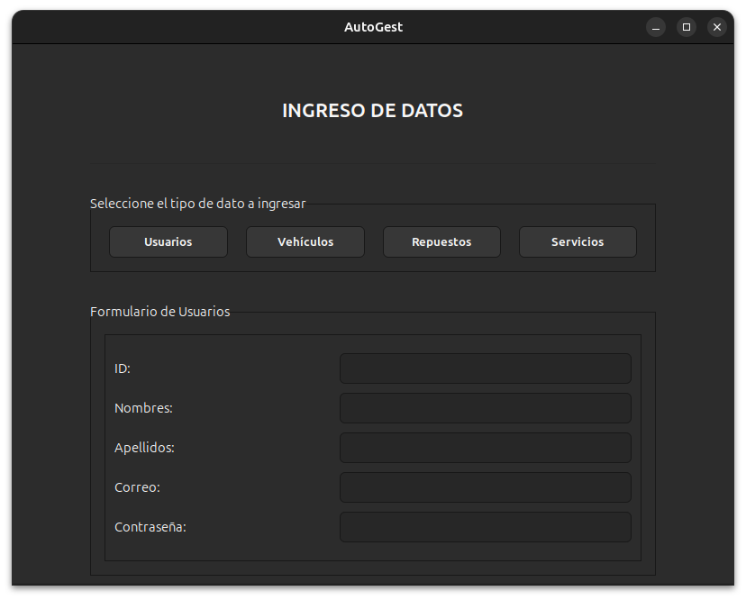

5. Gestion de Entideades

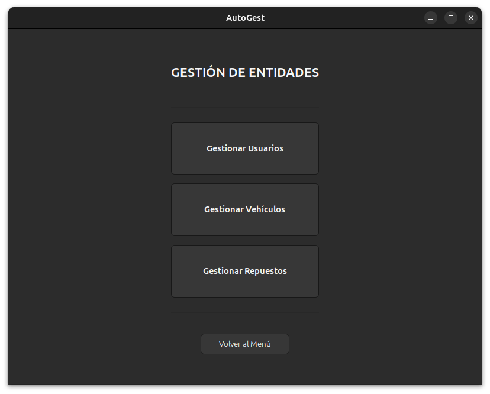

6. Generar Servicios

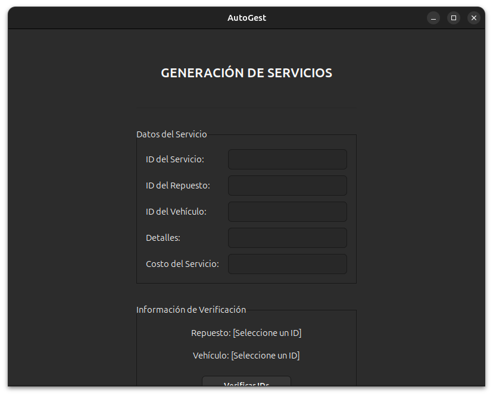

7. Cancelar Facura

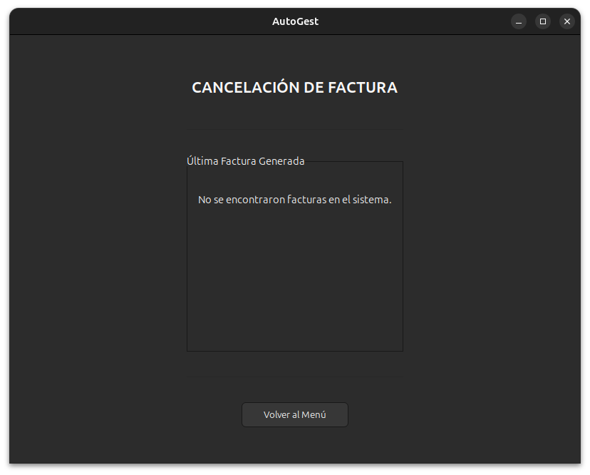

8. Interfaz Usuario

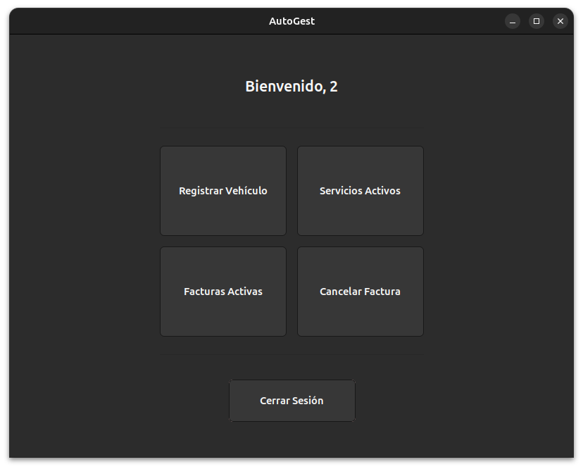

9. Registrar Vehiculos

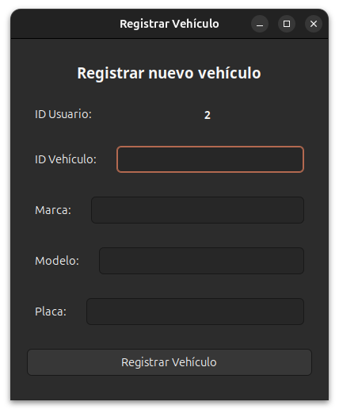

10. Servicios Activos

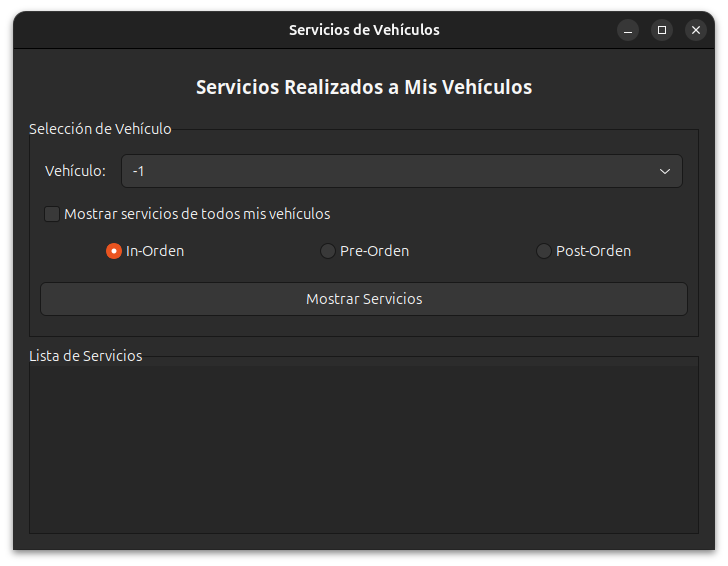

11. Facturas Activas

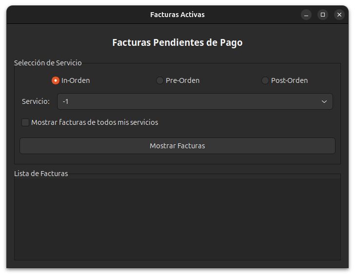

12. Cancelar Factura

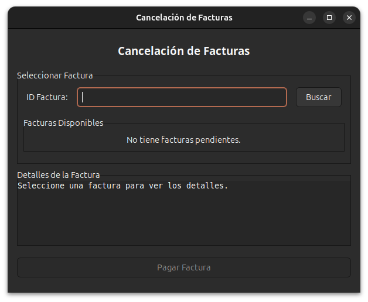